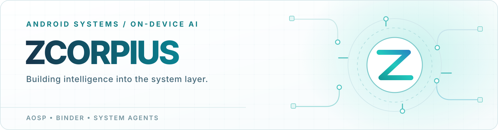

  

  <strong>从系统底层到智能交互。</strong> 
  我关注 Android 平台工程与端侧 AI 的交汇：从 AOSP 设备配置、HAL 和 Binder / AIDL， 
  到能持续对话、规划任务并在系统中执行的 Agent。

  

  <strong>正在构建 MatrixAgent</strong> 
  一个面向定制 Android ROM 的系统级 Agent。Launcher、版本化 SDK 与 System Host 串起对话、计划、语音、端侧模型和跨应用悬浮会话； 
  让模型能力有清晰的系统边界，也让交互从回答走向执行。

  <a href="https://github.com/Zcorpius/MatrixAgentProject">项目主页</a>
  &nbsp;·&nbsp;
  <a href="https://github.com/Zcorpius/MatrixAgentProject#experience">真机界面</a>
  &nbsp;·&nbsp;
  <a href="https://github.com/Zcorpius/MatrixAgentProject#architecture">系统架构</a>
  &nbsp;·&nbsp;
  <a href="https://zcorpius.github.io/">技术博客</a>

AOSP &nbsp;·&nbsp; Framework &nbsp;·&nbsp; System Services &nbsp;·&nbsp; On-device AI

